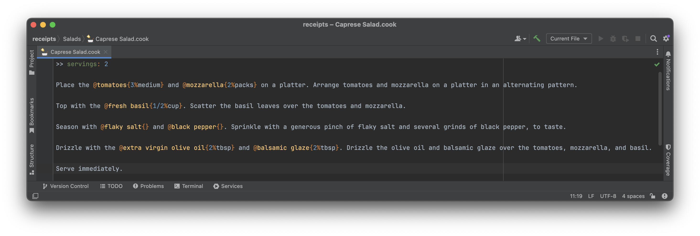

# Cooklang

A plugin for [IntelliJ IDEA](https://www.jetbrains.com/idea) adding support for [Cooklang](https://cooklang.org)

## Installation

You can install the plugin (named "Cooklang") from the plugins section inside your JetBrains IDE or download it from the [JetBrains Plugin Repository](https://plugins.jetbrains.com/plugin/24032-cooklang).

## Contributing

Small and large contributions welcome! 

For new features or substantial changes, please open an issue
beforehand so that it can be discussed.